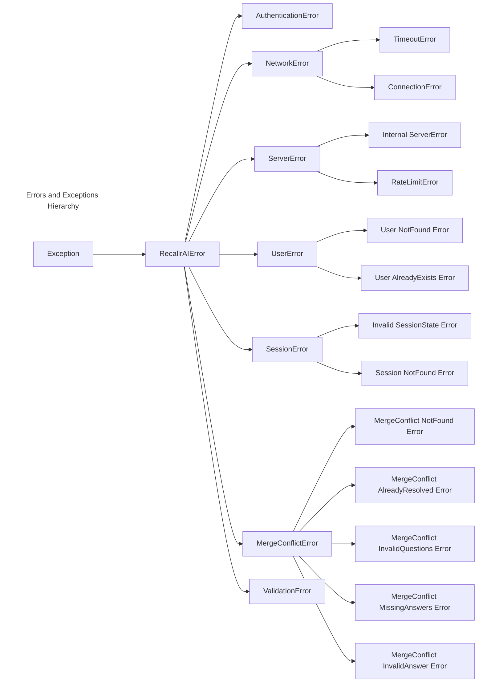

# RecallrAI Python SDK

Official Python SDK for RecallrAI – a revolutionary contextual memory system that enables AI assistants to form meaningful connections between conversations, just like human memory.

## Installation

Install the SDK via Poetry or pip:

```bash
poetry add recallrai
# or
pip install recallrai
```

## Initialization

Create a client instance with your API key and project ID:

```python
from recallrai import RecallrAI

client = RecallrAI(
    api_key="rai_yourapikey",
    project_id="project-uuid",
    base_url="https://api.recallrai.com",  # custom endpoint if applicable
    timeout=60,  # seconds
)
```

## User Management

### Create a User

```python
from recallrai.exceptions import UserAlreadyExistsError
try:
    user = client.create_user(user_id="user123", metadata={"name": "John Doe"})
    print(f"Created user: {user.user_id}")
    print(f"User metadata: {user.metadata}")
    print(f"Created at: {user.created_at}")
except UserAlreadyExistsError as e:
    print(f"Error: {e}")
```

### Get a User

```python
from recallrai.exceptions import UserNotFoundError
try:
    user = client.get_user("user123")
    print(f"User metadata: {user.metadata}")
    print(f"Last active: {user.last_active_at}")
except UserNotFoundError as e:
    print(f"Error: {e}")
```

### List Users

```python
user_list = client.list_users(offset=0, limit=10, metadata_filter={"role": "admin"})
print(f"Total users: {user_list.total}")
print(f"Has more users: {user_list.has_more}")

for user in user_list.users:
    print(f"User ID: {user.user_id}")
    print(f"Metadata: {user.metadata}")
    print(f"Created at: {user.created_at}")
    print(f"Last active: {user.last_active_at}")
    print("---")
```

### Update a User

```python
from recallrai.exceptions import UserNotFoundError, UserAlreadyExistsError
try:
    user = client.get_user("user123")
    # update() mutates the instance; no value is returned
    user.update(
        new_metadata={"name": "John Doe", "role": "admin"},
        new_user_id="john_doe"
    )
    print(f"Updated user ID: {user.user_id}")
    print(f"Updated metadata: {user.metadata}")
    print(f"Last active: {user.last_active_at}")
except UserNotFoundError as e:
    print(f"Error: {e}")
except UserAlreadyExistsError as e:
    print(f"Error: {e}")
```

### Refresh User Instance

```python
from recallrai.exceptions import UserNotFoundError
try:
    user = client.get_user("john_doe")
    user.refresh()
    print(f"Refreshed user metadata: {user.metadata}")
    print(f"Last active: {user.last_active_at}")
except UserNotFoundError as e:
    print(f"Error: {e}")
```

### Delete a User

```python
from recallrai.exceptions import UserNotFoundError
try:
    user = client.get_user("john_doe")
    user.delete()
    print("User deleted successfully")
except UserNotFoundError as e:
    print(f"Error: {e}")
```

## Session Management

### Create a Session

```python
from recallrai.exceptions import UserNotFoundError
from recallrai.session import Session

try:
    # First, get the user
    user = client.get_user("user123")
    
    # Create a session for the user.
    session: Session = user.create_session(
        auto_process_after_seconds=600,
        metadata={"type": "chat"}
    )
    print("Created session id:", session.session_id)
except UserNotFoundError as e:
    print(f"Error: {e}")
```

### Get an Existing Session

```python
from recallrai.exceptions import UserNotFoundError, SessionNotFoundError

try:
    # First, get the user
    user = client.get_user("user123")
    
    # Retrieve an existing session by its ID
    session = user.get_session(session_id="session-uuid")
    print("Session status:", session.status)
    print("Session metadata:", session.metadata)
except UserNotFoundError as e:
    print(f"Error: {e}")
except SessionNotFoundError as e:
    print(f"Error: {e}")
```

### Update a Session

```python
from recallrai.exceptions import UserNotFoundError, SessionNotFoundError
try:
    # First, get the user
    user = client.get_user("user123")
    
    # Retrieve an existing session by its ID
    session = user.get_session(session_id="session-uuid")
    
    # Update session metadata
    session.update(new_metadata={"type": "support_chat"})
    print("Updated session metadata:", session.metadata)
except UserNotFoundError as e:
    print(f"Error: {e}")
except SessionNotFoundError as e:
    print(f"Error: {e}")
```

### Refresh a Session

```python
from recallrai.exceptions import UserNotFoundError, SessionNotFoundError
try:
    # First, get the user
    user = client.get_user("user123")

    # Retrieve an existing session by its ID
    session = user.get_session(session_id="session-uuid")

    # Refresh session data from the server
    session.refresh()
    print("Session status:", session.status)
    print("Refreshed session metadata:", session.metadata)
except UserNotFoundError as e:
    print(f"Error: {e}")
except SessionNotFoundError as e:
    print(f"Error: {e}")
```

### List Sessions

```python
from recallrai.exceptions import UserNotFoundError

try:
    # First, get the user
    user = client.get_user("user123")
    
    # List sessions for this user with optional metadata filters
    session_list = user.list_sessions(
        offset=0,
        limit=10,
        metadata_filter={"type": "chat"},           # optional
        user_metadata_filter={"role": "admin"}       # optional
    )
    print(f"Total sessions: {session_list.total}")
    print(f"Has more sessions: {session_list.has_more}")
    for session in session_list.sessions:
        print(session.session_id, session.status, session.metadata)
except UserNotFoundError as e:
    print(f"Error: {e}")
```

### Session – Adding Messages

```python
from recallrai.exceptions import UserNotFoundError, SessionNotFoundError, InvalidSessionStateError
from recallrai.models import MessageRole

try:
    # Add a user message
    session.add_message(role=MessageRole.USER, content="Hello! How are you?")
    
    # Add an assistant message
    session.add_message(role=MessageRole.ASSISTANT, content="I'm an assistant. How can I help you?")
    
    # Available message roles:
    # - MessageRole.USER: Messages from the user/human
    # - MessageRole.ASSISTANT: Messages from the AI assistant
except UserNotFoundError as e:
    print(f"Error: {e}")
except SessionNotFoundError as e:
    print(f"Error: {e}")
except InvalidSessionStateError as e:
    print(f"Error: {e}")
```

### Session – Retrieving Context

```python
from recallrai.exceptions import UserNotFoundError, SessionNotFoundError
from recallrai.models import RecallStrategy

try:
    # Get context with default balanced strategy
    context = session.get_context()
    print("Context:", context.context)
    
    # Get context with specific recall strategy
    context = session.get_context(recall_strategy=RecallStrategy.LOW_LATENCY)
    print("Context:", context.context)
    
    # Available recall strategies:
    # - RecallStrategy.LOW_LATENCY: Fast retrieval with basic relevance
    # - RecallStrategy.BALANCED: Good balance of speed and quality (default)
    # - RecallStrategy.DEEP: More thorough but slower memory search
except UserNotFoundError as e:
    print(f"Error: {e}")
except SessionNotFoundError as e:
    print(f"Error: {e}")
```

### Session – Process Session

```python
from recallrai.exceptions import UserNotFoundError, SessionNotFoundError, InvalidSessionStateError

try:
    session.process()
except UserNotFoundError as e:
    print(f"Error: {e}")
except SessionNotFoundError as e:
    print(f"Error: {e}")
except InvalidSessionStateError as e:
    print(f"Error: {e}")
```


### Session – List Messages

```python
from recallrai.exceptions import UserNotFoundError, SessionNotFoundError

try:
    # Paginated retrieval
    messages = session.get_messages(offset=0, limit=50)
    for msg in messages.messages:
        print(f"{msg.role.value.capitalize()} (at {msg.timestamp}): {msg.content}")
    print(f"Has more?: {messages.has_more}")
    print(f"Total messages: {messages.total}")
except UserNotFoundError as e:
    print(f"Error: {e}")
except SessionNotFoundError as e:
    print(f"Error: {e}")
```

## User Memories

### List User Memories (with optional category filters)

```python
from recallrai.exceptions import UserNotFoundError, InvalidCategoriesError

try:
    user = client.get_user("user123")
    memories = user.list_memories(
        categories=["food_preferences", "allergies"],  # optional
        offset=0,
        limit=20,
    )
    for mem in memories.items:
        print(f"Memory ID: {mem.memory_id}")
        print(f"Categories: {mem.categories}")
        print(f"Content: {mem.content}")
        print(f"Created at: {mem.created_at}")
        print("---")
    print(f"Has more?: {memories.has_more}")
    print(f"Total memories: {memories.total}")
except UserNotFoundError as e:
    print(f"Error: {e}")
except InvalidCategoriesError as e:
    print(f"Invalid categories: {e.invalid_categories}")
    print(f"Error: {e}")
```

## Merge Conflict Management

When RecallrAI processes sessions, it may detect conflicts between new memories and existing ones. The SDK provides comprehensive tools to handle these merge conflicts, allowing you to guide the resolution process through clarifying questions.

### List Merge Conflicts

```python
from recallrai.exceptions import UserNotFoundError
from recallrai.models import MergeConflictStatus

try:
    user = client.get_user("user123")
    
    # List all merge conflicts (with optional status filter)
    conflicts = user.list_merge_conflicts(
        offset=0,
        limit=10,
        status=MergeConflictStatus.PENDING,  # optional: filter by status
        sort_by="created_at",  # created_at, resolved_at
        sort_order="desc",  # asc, desc
    )
    
    print(f"Total conflicts: {conflicts.total}")
    print(f"Has more: {conflicts.has_more}")
    
    for conflict in conflicts.conflicts:
        print(f"Conflict ID: {conflict.conflict_id}")
        print(f"Status: {conflict.status}")
        print(f"New memory: {conflict.new_memory_content}")
        print(f"Conflicting memories: {len(conflict.conflicting_memories)}")
        print(f"Questions: {len(conflict.clarifying_questions)}")
        print(f"Created at: {conflict.created_at}")
        print("---")
        
except UserNotFoundError as e:
    print(f"Error: {e}")
```

### Get a Specific Merge Conflict

```python
from recallrai.exceptions import UserNotFoundError, MergeConflictNotFoundError

try:
    user = client.get_user("user123")
    conflict = user.get_merge_conflict("conflict-uuid")
    
    print(f"Conflict ID: {conflict.conflict_id}")
    print(f"Status: {conflict.status.value}")
    print(f"New memory content: {conflict.new_memory_content}")
    
    # Examine conflicting memories
    print("\nConflicting memories:")
    for memory in conflict.conflicting_memories:
        print(f"  Content: {memory.content}")
        print(f"  Reason: {memory.reason}")
        print()
    
    # View clarifying questions
    print("Clarifying questions:")
    for question in conflict.clarifying_questions:
        print(f"  Question: {question.question}")
        print(f"  Options: {question.options}")
        print()
        
except UserNotFoundError as e:
    print(f"Error: {e}")
except MergeConflictNotFoundError as e:
    print(f"Error: {e}")
```

### Resolve a Merge Conflict

```python
from recallrai.exceptions import (
    UserNotFoundError, 
    MergeConflictNotFoundError,
    MergeConflictAlreadyResolvedError,
    MergeConflictInvalidQuestionsError,
    MergeConflictMissingAnswersError,
    MergeConflictInvalidAnswerError,
    ValidationError
)
from recallrai.models import MergeConflictAnswer

try:
    user = client.get_user("user123")
    conflict = user.get_merge_conflict("conflict-uuid")
    
    # Prepare answers to the clarifying questions
    answers = []
    for question in conflict.clarifying_questions:
        print(f"  Question: {question.question}")
        print(f"  Options: {question.options}")
        print()

        answer = MergeConflictAnswer(
            question=question.question,
            answer=question.options[0],  # Select first option
            message="User prefers this option based on recent conversation"
        )
        answers.append(answer)
    
    # Resolve the conflict
    conflict.resolve(answers)
    print(f"Conflict resolved! Status: {conflict.status}")
    print(f"Resolved at: {conflict.resolved_at}")
    
    if conflict.resolution_data:
        print(f"Resolution data: {conflict.resolution_data}")
        
except UserNotFoundError as e:
    print(f"Error: {e}")
except MergeConflictNotFoundError as e:
    print(f"Error: {e}")
except MergeConflictAlreadyResolvedError as e:
    print(f"Error: {e}")
except MergeConflictInvalidQuestionsError as e:
    print(f"Error: {e}")
    if e.invalid_questions:
        print(f"Invalid questions: {e.invalid_questions}")
except MergeConflictMissingAnswersError as e:
    print(f"Error: {e}")
    if e.missing_questions:
        print(f"Missing answers for: {e.missing_questions}")
except MergeConflictInvalidAnswerError as e:
    print(f"Error: {e}")
    if e.question and e.valid_options:
        print(f"Question: {e.question}")
        print(f"Valid options: {e.valid_options}")
except ValidationError as e:
    print(f"Error: {e}")
```

### Refresh Merge Conflict Data

```python
from recallrai.exceptions import UserNotFoundError, MergeConflictNotFoundError

try:
    user = client.get_user("user123")
    conflict = user.get_merge_conflict("conflict-uuid")
    
    # Refresh to get latest status from server
    conflict.refresh()
    print(f"Current status: {conflict.status}")
    print(f"Last updated: {conflict.resolved_at}")
    
except UserNotFoundError as e:
    print(f"Error: {e}")
except MergeConflictNotFoundError as e:
    print(f"Error: {e}")
```

### Working with Merge Conflict Statuses

The merge conflict system uses several status values to track the lifecycle of conflicts:

- **PENDING**: Conflict detected and waiting for resolution
- **IN_QUEUE**: Conflict is queued for automated processing  
- **RESOLVING**: Conflict is being processed
- **RESOLVED**: Conflict has been successfully resolved
- **FAILED**: Conflict resolution failed

## Example Usage with LLMs

```python
import openai
from recallrai import RecallrAI
from recallrai.exceptions import UserNotFoundError
from recallrai.models import MessageRole

# Initialize RecallrAI and OpenAI clients
rai_client = RecallrAI(
    api_key="rai_yourapikey", 
    project_id="your-project-uuid"
)
oai_client = openai.OpenAI(api_key="your-openai-api-key")

def chat_with_memory(user_id, session_id=None):
    # Get or create user
    try:
        user = rai_client.get_user(user_id)
    except UserNotFoundError:
        user = rai_client.create_user(user_id)
    
    # Create a new session or get an existing one
    if session_id:
        session = user.get_session(session_id=session_id)
    else:
    session = user.create_session(auto_process_after_seconds=1800)
        print(f"Created new session: {session.session_id}")
    
    print("Chat session started. Type 'exit' to end the conversation.")
    
    while True:
        # Get user input
        user_message = input("You: ")
        if user_message.lower() == 'exit':
            break
        
        # Add the user message to RecallrAI
        session.add_message(role=MessageRole.USER, content=user_message)
        
        # Get context from RecallrAI after adding the user message
        # You can specify a recall strategy for different performance/quality trade-offs
        context = session.get_context()  # Uses default BALANCED strategy
        
        # Create a system prompt that includes the context
        system_prompt = f"""You are a helpful assistant with memory of previous conversations.
        
        MEMORIES ABOUT THE USER:
        {context.context}
        
        You can use the above memories to provide better responses to the user.
        Don't mention that you have access to memories unless you are explicitly asked."""
        
        # Get previous messages
    messages = session.get_messages(offset=0, limit=50)
    previous_messages = [{"role": message.role, "content": message.content} for message in messages.messages]

        # Call the LLM with the system prompt and conversation history
        response = oai_client.chat.completions.create(
            model="gpt-4o-mini",
            messages=[
                {"role": "system", "content": system_prompt},
                **previous_messages,
            ],
            temperature=0.7
        )
        
        assistant_message = response.choices[0].message.content
        
        # Print the assistant's response
        print(f"Assistant: {assistant_message}")
        
        # Add the assistant's response to RecallrAI
        session.add_message(role=MessageRole.ASSISTANT, content=assistant_message)
    
    # Process the session at the end of the conversation
    print("Processing session to update memory...")
    session.process()
    print(f"Session ended. Session ID: {session.session_id}")
    return session.session_id

# Example usage
if __name__ == "__main__":
    user_id = "user123"
    # To continue a previous session, uncomment below and provide the session ID
    # previous_session_id = "previously-saved-session-uuid"
    # session_id = chat_with_memory(user_id, previous_session_id)
    
    # Start a new session
    session_id = chat_with_memory(user_id)
    print(f"To continue this conversation later, use session ID: {session_id}")
```

## Exception Handling

The RecallrAI SDK implements a comprehensive exception hierarchy to help you handle different error scenarios gracefully:

### Base Exception

- **RecallrAIError**: The base exception for all SDK-specific errors. All other exceptions inherit from this.

### Authentication Errors

- **AuthenticationError**: Raised when there's an issue with your API key or project ID authentication.

### Network-Related Errors

- **TimeoutError**: Occurs when a request takes too long to complete.
- **ConnectionError**: Happens when the SDK cannot establish a connection to the RecallrAI API.

### Server Errors

- **InternalServerError**: Raised when the RecallrAI API returns a 5xx error code.
- **RateLimitError**: Raised when the API rate limit has been exceeded (HTTP 429). When available, the `retry_after` value is provided in the exception details.

### User-Related Errors

- **UserNotFoundError**: Raised when attempting to access a user that doesn't exist.
- **UserAlreadyExistsError**: Occurs when creating a user with an ID that already exists.
- **InvalidCategoriesError**: Raised when filtering user memories by categories that do not exist in the project. The exception contains the list of invalid categories in `e.invalid_categories`.

### Session-Related Errors

- **SessionNotFoundError**: Raised when attempting to access a non-existent session.
- **InvalidSessionStateError**: Occurs when performing an operation that's not valid for the current session state (e.g., adding a message to a processed session).

### Merge Conflict-Related Errors

- **MergeConflictError**: Base class for merge conflict-related exceptions.
- **MergeConflictNotFoundError**: Raised when attempting to access a merge conflict that doesn't exist.
- **MergeConflictAlreadyResolvedError**: Occurs when trying to resolve a merge conflict that has already been processed.
- **MergeConflictInvalidQuestionsError**: Raised when the provided questions don't match the original clarifying questions.
- **MergeConflictMissingAnswersError**: Occurs when not all required clarifying questions have been answered.
- **MergeConflictInvalidAnswerError**: Raised when an answer is not one of the valid options for a question.

### Input Validation Errors

- **ValidationError**: Raised when provided data doesn't meet the required format or constraints.

### Importing Exceptions

You can import exceptions directly from the `recallrai.exceptions` module:

```python
# Import specific exceptions
from recallrai.exceptions import (
    UserNotFoundError, 
    SessionNotFoundError,
    InvalidCategoriesError,
    MergeConflictNotFoundError,
    MergeConflictAlreadyResolvedError,
    MergeConflictInvalidQuestionsError,
    MergeConflictMissingAnswersError,
    MergeConflictInvalidAnswerError,
)

# Import all exceptions
from recallrai.exceptions import (
    RecallrAIError,
    AuthenticationError,
    TimeoutError,
    ConnectionError,
    InternalServerError,
    RateLimitError,
    SessionNotFoundError, 
    InvalidSessionStateError,
    UserNotFoundError, 
    UserAlreadyExistsError,
    InvalidCategoriesError,
    ValidationError,
    MergeConflictError,
    MergeConflictNotFoundError,
    MergeConflictAlreadyResolvedError,
    MergeConflictInvalidQuestionsError,
    MergeConflictMissingAnswersError,
    MergeConflictInvalidAnswerError,
)
```

### Exception Hierarchy Diagram



### Best Practices for Error Handling

When implementing error handling with the RecallrAI SDK, consider these best practices:

1. **Handle specific exceptions first**: Catch more specific exceptions before general ones.

   ```python
   try:
       # SDK operation
   except UserNotFoundError:
       # Specific handling
   except RecallrAIError:
       # General fallback
   ```

2. **Implement retry logic for transient errors**: Network and timeout errors might be temporary.

3. **Log detailed error information**: Exceptions contain useful information for debugging.

4. **Handle common user flows**: For example, check if a user exists before operations, or create them if they don't:

   ```python
   try:
       user = client.get_user(user_id)
   except UserNotFoundError:
       user = client.create_user(user_id)
   ```

For more detailed information on specific exceptions, refer to the API documentation.

## Conclusion

This README outlines the basic usage of the RecallrAI SDK functions for user and session management. For additional documentation and advanced usage, please see the [official documentation](https://docs.recallrai.com) or the source code repository on [GitHub](https://github.com/recallrai/sdk-python).
